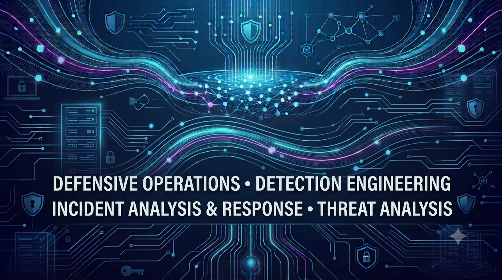

  

# 👋 Hi, I'm Lake Brown  

🛡️ SOC Analyst | Cybersecurity | Security+ | SIEM | Threat Detection | Incident Response

I'm building hands-on experience in security monitoring,
log analysis, threat detection, and incident response.

Currently focused on:

- 🔎 SOC analysis
- 📊 Splunk & SIEM
- 🛡️ Threat detection
- 🌐 Network security
- 🐧 Linux
- 🚨 Incident response
- 📝 Security documentation & investigation

---

## 🛡️ Security Skills

| Area | Technologies |
|---|---|
| SIEM & Monitoring | Splunk, SIEM, Log Analysis, Alert Triage |
| IDS/Detection | Suricata, Security Onion, IDS/IPS, Threat Detection |
| Network Analysis | Wireshark, TCP/IP, Packet Tracer, Network Traffic Analysis|
| Operating Systems | Linux (Kali, Ubuntu), Windows, MacOS |
|Incident Response | Incident Investigation, Incident Response, Security Documentation |
| Scripting | Python, Bash |
| Version Control | Git/GitHub |

---

### 🔎 SOC Projects

### 🏠 HomeSOC — Physical Cybersecurity Lab

Hands-on physical cybersecurity lab focused on network monitoring, intrusion detection, centralized logging, and security investigation.

Skills: Linux • Suricata • Splunk • Wireshark • Networking • Network Security • Incident Investigation

[View Project](https://github.com/lake-brown/HomeSOC--physical--lab)

---

### 📧 Phishing Investigation
Splunk-based investigation of a simulated phishing incident.

**Skills:** Splunk • SIEM • Phishing Analysis • Incident Response

[View Project](LINK)

---

🔬 Current Focus
Security monitoring and alert triage
Splunk and SIEM investigations
Windows/Linux log analysis
Network traffic analysis with Wireshark
Incident response playbooks
Threat detection and documentation

---

### 🚨 Brute Force Detection
Investigation of suspicious authentication activity using
Windows logs and Splunk.

**Skills:** Windows • Splunk • Log Analysis • Detection

[View Project](LINK)

---

### 🌐 Network Traffic Investigation
Analysis of suspicious network traffic using Wireshark.

**Skills:** Wireshark • TCP/IP • DNS • Network Analysis

[View Project](LINK)  
---
## 🌐 Portfolio

Check out my **portfolio website** to see my projects, demos, and professional experience:  
🔗 [lakes-portfolio](https://lakes-portfolio.vercel.app/)  

---

## 📫 Let’s Connect
- LinkedIn: [LinkedIn](https://www.linkedin.com/in/lakelyne-brown-a74a54356) 
- Email: *(brownlakelyne@gmail.com)*  

---

⭐ *Always learning, building, and documenting my journey into cybersecurity.*
